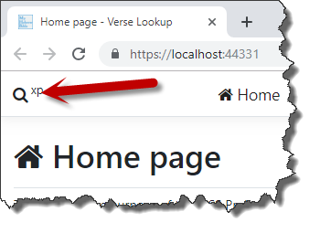
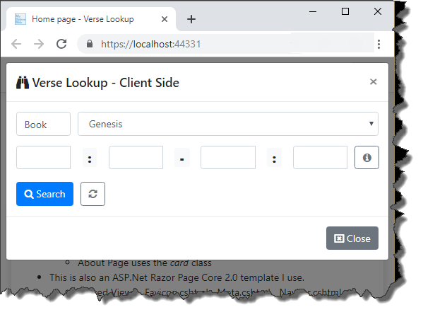
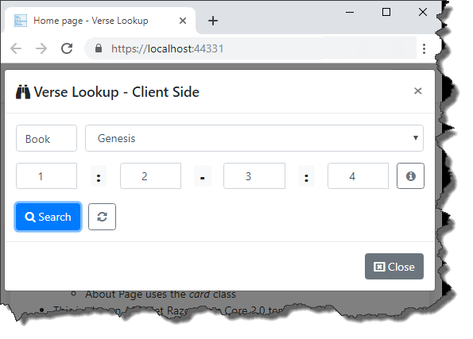
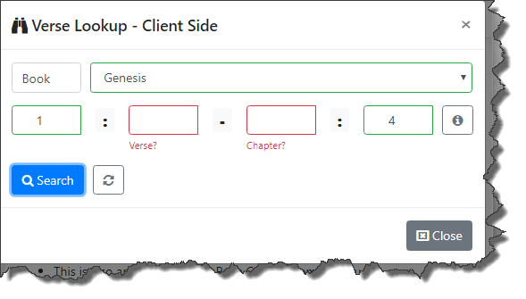
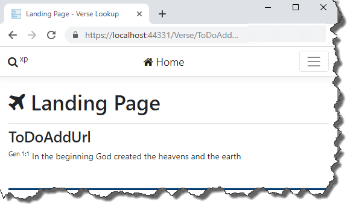
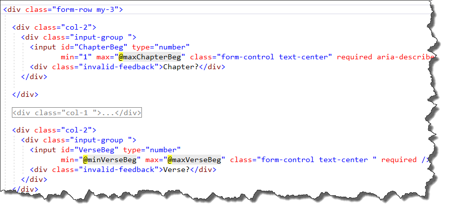

# BibleVerseLookup
Simple Asp.Net 2.2 Razor Page web app to see how to create a bible verse lookup control by leveraging JavaScript and JSON

# Specs
These are instructions for someone knowledgeable with JavaScript, JQuery and JSON to implement a client side **Bible Verse Lookup** UI control.  When finished I would then like to add this to [My Hebrew Bible](https://myhebrewbible.com) (**MHB**) and remove portions of code that do this kind of work on the server-side.

I would do this myself, but I'm just not good at JavaScript like I would like to be so I'm throwing this out on GitHub for others to look at and see if they can find a good solution.  Having the best verse lookup UI control for **MHB** is paramount to its success, so it's worth my time writing up a good specs document.  

I tried to create as much as possible all the things necessary to accomplish this goal (considering I'm not an expert in JavaScript/JQuery/JSON).  Having said that, I'm open to constructive criticism.  

The sample is a ASP.NET Core 2.2 Razor Pages Web App that leverages [Bootstrap 4.3.1](https://getbootstrap.com/) and the Form [TagHelper](https://docs.microsoft.com/en-us/aspnet/core/mvc/views/working-with-forms?view=aspnetcore-2.2).  I've used server side stuff to make the sample work, but wouldn't be necessary with a JavaScript only solution (e.g. partial views and some code behind).


# Design Considerations
My thinking is that if I can do all validation on the client, the user can be assured that their queries would return a valid set of verses.  This can be accomplished by...
	1. Creating a bible book lookup control limited to only valid entries (see the partial view *_BookDataList.cshtml*)
	2. Leveraged the `min` and `max` attributes for of each of the four Html `input` controls (**ChapterBeg**, **ChapterEnd**, **VerseBeg** and **VerseEnd**)
	3. Using these constraints along with enabling and disabling controls at the appropriate time should ensure that only a valid query could be submitted  

 
# Domain Rules
- All searches are constrained to a single Book.  
		- E.g. you can't have a range of verses that start in Genesis and end in Exodus.
- ChapterBeg, ChapterEnd, VerseBeg and VerseEnd can only be >= 1
- ChapterBeg must be <= ChapterEnd
- ChapterEnd must be <= LastChapter for the selected book
- VerseBeg must be <= LastVerse for the selected Book and selected ChapterBeg
- VerseEnd must be <= LastVerse for the selected Book and selected ChapterEnd
	- Note, VerseBeg could be > VerseEnd if ChapterBeg and ChapterEnd are different.  
	- Example *Genesis 49:33-50:1* is valid even though 33 > 1
- When the **Search** button is clicked, it is a requirement that form validation be performed.
	- I'm using some JavaScript copied from the Bootstrap [website](https://getbootstrap.com/docs/4.3/components/forms/#custom-styles) which allows for custom Bootstrap form validation messages.  It's nice because it validates all the fields and shows error messages for those that are not valid. As the form currently stands it only validates all the `required` fields to make sure they have values in them.  Maybe that's all that is necessary because the four `input` fields are defined as `type="number"`. The bible book fields is a `select` drop down list control so it should always have a valid value.
- When the **Reset** button is clicked, the bible book `select` control and the four `input` controls are set to blank and focus is moved to the bible book `select` control.

# Screen Shots
### Home page with arrow pointing to search modal initiate button


### search modal form open


### search modal form filled out


### search modal form showing errors



### Verses Landing Page
After valid values are entered and after clicking the Search button the user is taken to this landing page.


# Data

## Data for Bible Book control - version 1
- First way it uses a **Auto-Suggested Values** solution .  An input text field gets populated by a `<datalist>`.
- Inspiration came from this [blog](https://love2dev.com/blog/datalist/) written by [Chris Love](https://github.com/docluv).  Here is some a snippet of code...
```html
	<input asp-for="VerseRange.Book" type="text" list="books" class="form-control" />
	<datalist id="books">
		<partial name="@PartialViews.BookDataList"> />
	</datalist>
```

### _BookDataList.cshtml
- @PartialViews.BookDataList = "_BookDataList.cshtml"
Sample Code...
```html
<option value="Genesis"></option>
<option value="Exodus"></option>
<option value="Leviticus"></option>
```

## Data for Bible Book control - version 2
- Second way uses just a `<select>` (no input text field).
- See the partial views **_BookSelectList.cshtml** or **_BookSelectList2.cshtml**
- I don't know what would be the best solution
- Both ways can be experimented with by changing the `bool AutoSuggested` to `true` or `false` (see **_NavbarModalSearch.cshtml**).


## Data for `min` and `max`
- The `form` has four <input id="XXX" type="number" controls where XXX is *ChapterBeg*, *VerseBeg*, *ChapterEnd* and *VerseEnd*
- These controls are found in the **_NavbarModalSearch.cshtml** file (also ServerSide\Index.cshtml, but that's not the focus of the project)
- Each of these controls has a `required` attribute, an invalid warning div (e.g. `<div class="invalid-feedback">XXX?</div>`, and a pair of `min` and `max` attributes.
- The attributes `min` and `max` need to be dynamically changed based on the input values entered into by the user.
- In order to popuplate the `min` and `max`, JavaScript needs to be written (see **book.js** and **bookchapters.js**)
- `min` and `max` are essential in the **form validation process**
- **_NavbarModalSearch.cshtml** partial screen shot of *ChapterBeg* and *VerseBeg*
		

# JavaScript/Json Files
- Not being a JavaScript developer, I took a stab at how these two files might look.

## book.js
- Called when the `max` attributes of the **ChapterEnd** `input` controls need to be populated.
```json
let books = [
{ id: 1, lastchapter: 50 },
{ id: 2, lastchapter: 40 },
{ id: 3, lastchapter: 27 },
// ...
{ id: 66, lastchapter: 22 }
]; 
```

## bookchapters.js
- Called when the `max` attributes of the **VerseBeg** or **VerseEnd** `input` controls need to be populated.
```json
let bookchapters = [
{ bookid: 1, chapter: 1, lastverse: 31 },
{ bookid: 1, chapter: 2, lastverse: 25 },
{ bookid: 1, chapter: 3, lastverse: 24 },
...
{ bookid: 66, chapter: 22, lastverse: 1 }
]; 
```
- This has 1,189 entries.  Maybe it makes better sense to have this broken down into 66 individual files (e.g. bookchaptersGen.js, bookchaptersExo.js etc.)...I don't know.


# Form Validation Process


# Future Features
1. Add a **Multi Verse Button**
	- This would validate the form and then instead of going to the landing page would save them as a list of verses
	- It would be a requirement to delete individual items in the least.
	- When the user does select the Search button, the landing page would handle it correctly
2. Add a **Book/Chapter Button**
	- If the user selects this then the verse will open the whole chapter(s) and go to the begging of the specific verses.  Something like [Genesis Chapter 1](https://www.myhebrewbible.com/BookChapter/Genesis/1/god-creates-heaven-earth-plants-animals-a-man-named-adom)
	- This should be mutually exclusive to the **Multi Verse Button**


# Appendix
- **Scripts\SelectCodeGen.sql**: This is a file of some SQL I used against the **MHB** database to do some code generation.
- 
